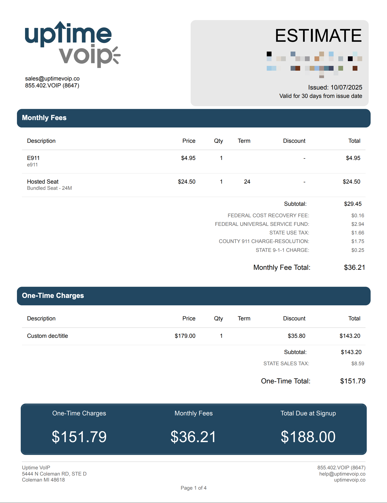

# OneBill Quote PDF Template

XSL-FO template that transforms OneBill billing system XML into branded PDF estimates for VoIP services.



## Quick Start

1. **Customize Branding**: Edit variables at the top of `template10071.xsl` (lines 10-26)
2. **Upload to OneBill**: Replace the existing template in your OneBill system
3. **Generate Quote**: Create a quote in OneBill to generate a PDF with your branding

## Branding Variables

All branding is controlled by variables at the top of `template10071.xsl`:

| Variable | Default Value | Used For |
|----------|--------------|----------|
| `$font_family` | `Arial, Helvetica, sans-serif` | All text throughout document |
| `$uptime_blue` | `#214761` | Section headers, colored boxes (see below) |
| `$company_name` | `Uptime VoIP` | Footer company name |
| `$sales_email` | `sales@uptimevoip.co` | Header contact email |
| `$support_email` | `help@uptimevoip.co` | Footer support email |
| `$billing_email` | `billing@uptimevoip.co` | Legal notices section |
| `$phone_display` | `855.402.VOIP (8647)` | Header and footer phone |
| `$address_line1` | `5444 N Coleman RD, STE D` | Footer and legal notices |
| `$address_city` | `Coleman` | Footer and legal notices |
| `$address_state` | `MI` | Footer and legal notices |
| `$address_zip` | `48618` | Footer and legal notices |
| `$website` | `uptimevoip.co` | Footer website |

### Example: Changing Brand Color

```xml
<!-- Change from navy blue to your brand color -->
<xsl:variable name="uptime_blue" select="'#214761'" />
<!-- To: -->
<xsl:variable name="uptime_blue" select="'#FF5733'" />
```

## Colored Sections

The brand color (`$uptime_blue`) is used in these locations:

1. **"Monthly Fees" Header** - Navy blue background with white text
2. **"One-Time Charges" Header** - Navy blue background with white text
3. **Summary Totals Box** - Large navy blue panel at bottom showing final amounts
4. **Legal Section Headers** - Section numbers (1-18) in the Master Services Agreement

Changing `$uptime_blue` updates all of these sections simultaneously.

## Logo

The template uses the logo from OneBill's `businessImageUrl` field:
- **Header (Page 1)**: 150px wide logo with contact info
- **Continuation Pages**: 50px wide logo only

Upload your logo to OneBill's business profile to change it.

## Important Notes

⚠️ **Do NOT fix** the `quoteBusinsessProfile` typo - this matches OneBill's production XML schema
⚠️ **Testing requires OneBill** - there is no local XSL-FO processor in this repository
⚠️ **Date format is mm/dd/yyyy** - US format, not international dd/mm/yyyy

## Files

- `template10071.xsl` - Main template (use this one)
- `template10071.xsl.backup` - Original backup before redesign
- `contract_terms.txt` - Source text for legal terms (reference only)
- `CLAUDE.md` - Technical documentation for AI assistants
- `Onebill_quote1stpage.png` - Example output screenshot

## Support

For OneBill integration questions, refer to `OneBill Developer Guide.postman_collection (1).json` for XML structure examples.
